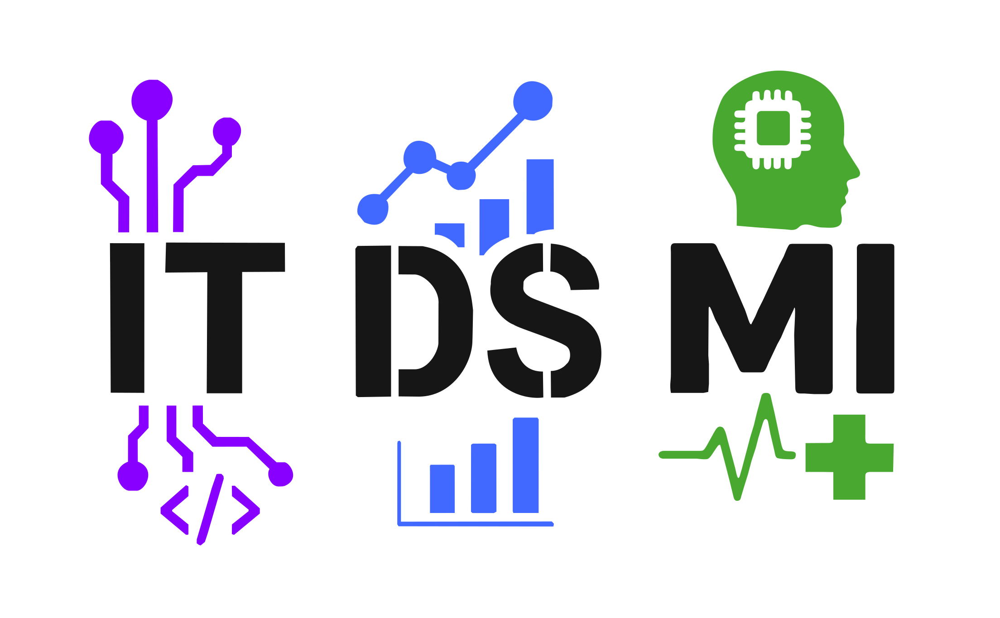
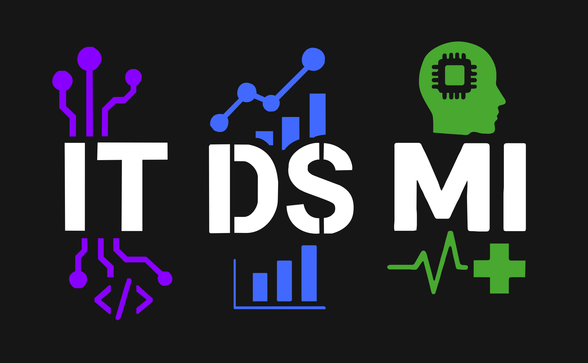
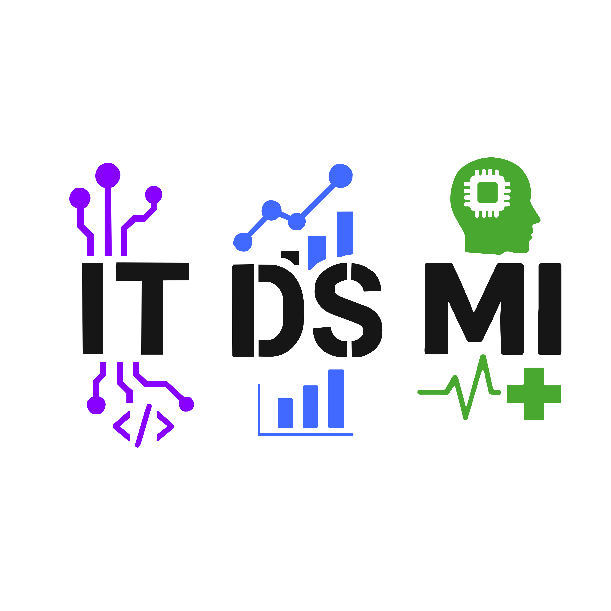
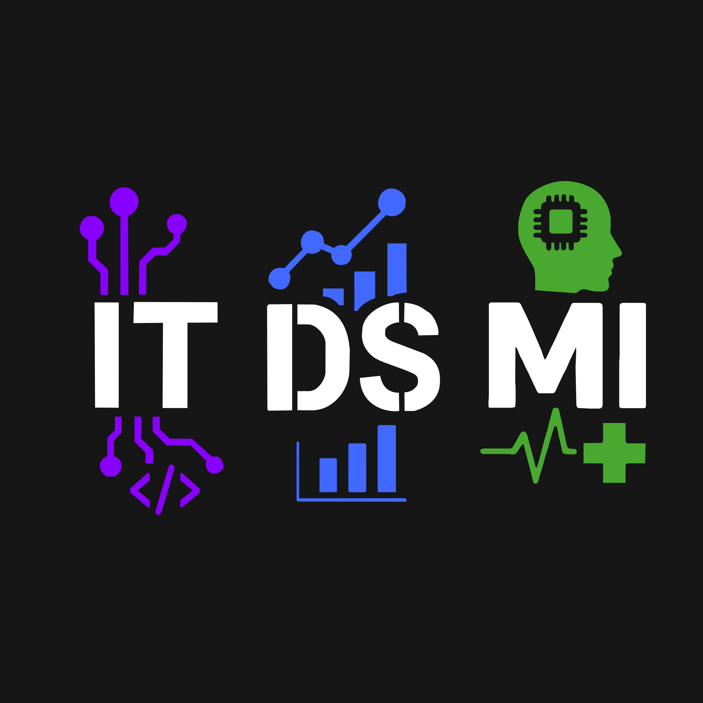

# ITDSMI - Frackmobil & Alumni

## Was ist der Verein?

Der Verein bezweckt die Betreuung des Frackmobils, des Diplombuchs, des Bartvertrags, der Frackbeschaffung und stellt Delegierte an den aktuellen Frackwochen-Verein. Darüber hinaus zielt der Verein darauf ab, eine Vernetzungsplattform für die Alumni der ZHAW-Informatikklassen zu etablieren, um den Austausch von Erfahrungen und Wissen zu fördern.

## Wie kann ich mitmachen?

Du kannst dich [hier](https://forms.gle/PARcTgF5RKGrdq25A) anmelden, wenn du in einem der folgenden Studiengänge an der ZHAW aktuell studierst oder ein solches Studium abgeschlossen hast:

- Informatik
- Data Science
- Medizininformatik

## Logos

  
  
<strong>Hell</strong>

  
  
<strong>Dunkel</strong>

### Quadratisches Logo für Social Media

  
  
<strong>Hell</strong>

  
  
<strong>Dunkel</strong>

### Farben

Das PDF [Color-Identity](../Colors/Color-Identity.pdf) zeigt die zu verwendende Farbgebungen der unterschiedlichen Studiengänge auf. 
