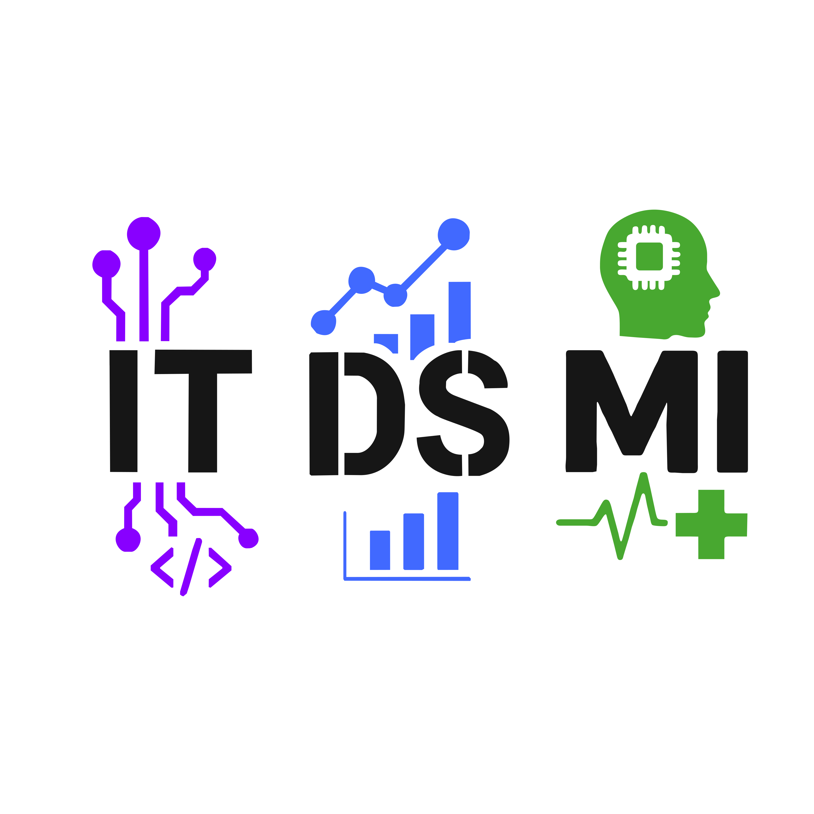

# Frackwochen- & Alumniverein IT, DS, MI

## Was ist der Verein?

## Wie kann ich mitmachen?

## Logos

  
  
<strong>Hell</strong>

  
  
<strong>Dunkel</strong>

### Quadratisches Logo für Social Media

  
  
<strong>Hell</strong>

  
  
<strong>Dunkel</strong>

### Farben

Das PDF [Color-Identity](../Colors/Color-Identity.pdf) zeigt die zu verwendende Farbgebungen der unterschiedlichen Studiengänge auf. 